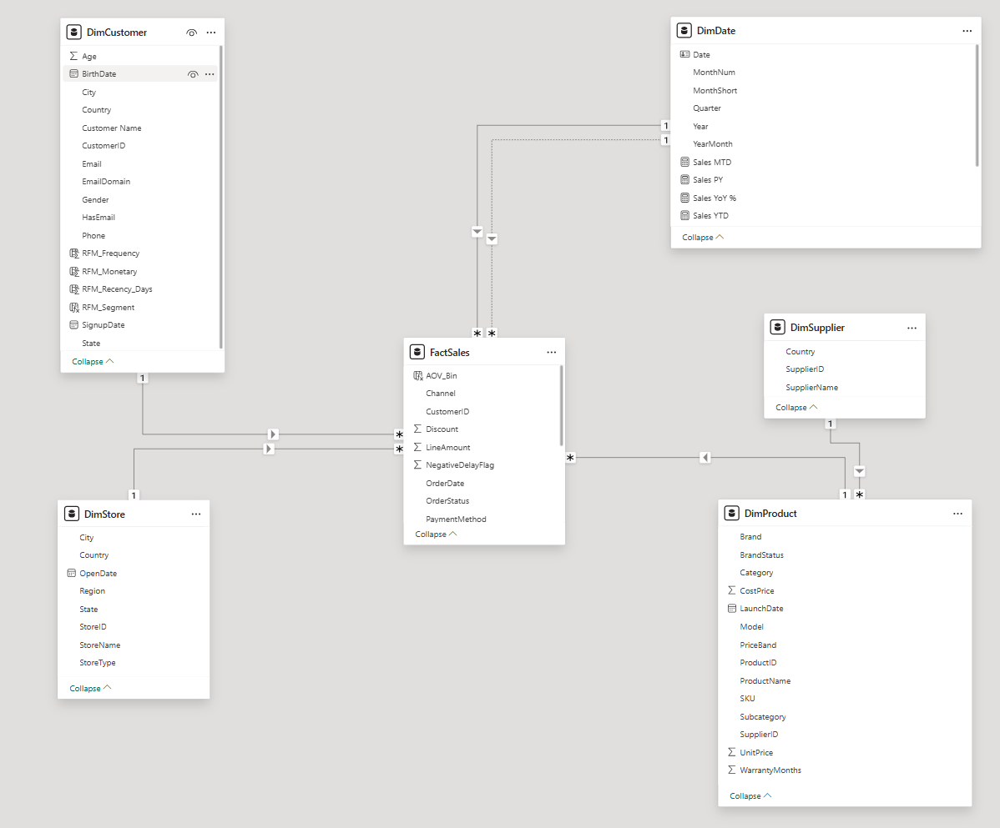

# 🛍️ Retail Clothing Data Analytics
**End‑to‑End Data Wrangling, Dimensional Modeling & Business Intelligence**

---

## 📌 Project Summary

This repository showcases an **end‑to‑end retail data analytics project** focused on transforming raw transactional data into **reliable, business‑ready insights**.

The project emphasizes **data quality, analytical rigor, and decision‑oriented reporting**, rather than dashboards alone. It demonstrates how structured data preparation, dimensional modeling, and validated metrics enable trustworthy analytics and actionable conclusions.

---

## 🎯 Business Context

Initial performance indicators revealed a critical issue:

> **Sales volume was growing strongly, but profitability was declining.**

This raised important questions:
- Is growth being driven by low‑margin products?
- Are sales increases translating into real customer value?
- Is the business reliant on acquisition rather than loyalty?
- Which categories, channels, and customer segments truly drive profit?

This project was designed to answer those questions using data.

---

## 🧹 Data Preparation & Quality Engineering

Before any analysis, a **structured and auditable data‑wrangling process** was implemented using **Power Query** in Power BI.

Key steps included:
- Data type validation and standardization
- Text normalization and consistency checks
- Feature engineering for analytics:
  - Customer age
  - Price bands
  - Email availability flags
  - Transaction‑level revenue calculations
- Shipping delay analysis and anomaly detection
- Explicit monitoring of missing or invalid key fields

All transformations were logged step‑by‑step to ensure transparency, reproducibility, and data trustworthiness.

📂 See `data-wrangling/` for the full transformation log.

---

## 🧱 Data Model & Architecture

A **dimensional star schema** was implemented to support scalable BI analysis and reliable DAX calculations.

### 📐 Star Schema Model


**Design highlights:**
- Central sales fact table
- Supporting customer, product, store, supplier, and date dimensions
- One‑to‑many relationships
- Dedicated date table for time intelligence

This structure ensures accurate filtering, aggregation, and performance across all reports.

---

## 📊 KPI Overview (Core Performance)

A high‑level dashboard was created to monitor overall business performance and surface critical trends.


The KPI overview highlights:
- Strong sales growth
- Declining profit margins
- Average Order Value (AOV)
- Customer Lifetime Value (CLV)

This view makes the **sales‑to‑profit disconnect** immediately visible and guides deeper diagnostic analysis.

---

## 🔍 Analytical Insights

Key findings from the analysis include:

- Sales growth was **not matched by profitability growth**
- Margin erosion was driven by **low‑margin product categories**
- A small number of “hero” categories generated disproportionate profit
- Growth was **acquisition‑led**, with weak customer retention
- Average Order Value showed stagnation despite higher transaction counts
- Data completeness issues directly affected segmentation and insights

These insights shifted the narrative from surface‑level revenue performance to **value efficiency and long‑term sustainability**.

---

## 💡 Data‑Driven Recommendations

Based on the findings, the following strategic actions were recommended:

- Shift from a **volume‑first** to a **value‑based** growth strategy
- Prioritize high‑margin product categories
- Improve customer retention through post‑purchase engagement
- Optimize pricing and discount strategies
- Focus investment on channels with higher AOV
- Strengthen data quality controls for more reliable decision‑making

All recommendations are grounded in validated metrics rather than assumptions.

---

## 🛠 Tools & Technologies

- **Power BI**
  - Power Query (Data Transformation)
  - DAX (Measures & Time Intelligence)
  - Dimensional Modeling (Star Schema)
- **Microsoft Excel**
  - Data wrangling and audit logs
- Retail transactional datasets
- Dimensional modeling best practices

---

## 👤 Individual Contribution

This project was completed as a group assignment.

My individual contributions focused on:
- Data wrangling strategy and execution
- Data quality validation and anomaly detection
- Dimensional modeling and relationship design
- DAX measure development and time‑intelligence logic
- Analytical interpretation and insight synthesis

---

## 📁 Repository Structure

```
retail-clothing-data-analytics/
├── data-wrangling/
│   └── retail-data-wrangling-log.xlsx
├── powerbi/
│   ├── model/
│   │   └── star-schema-model.png
│   ├── dashboards/
│   └── measures/
├── documentation/
│   └── retail-analytics-project-report.pdf
└── README.md
```

---

## 📘 Supporting Documentation

A detailed project report is available in the `documentation/` folder for deeper reference.  
The main README presents a concise, business‑focused summary.

---

## ⚠️ Disclaimer

This project was developed for **academic and portfolio demonstration purposes**.  
The data and insights are used to illustrate analytics techniques and are not intended for live business deployment.
